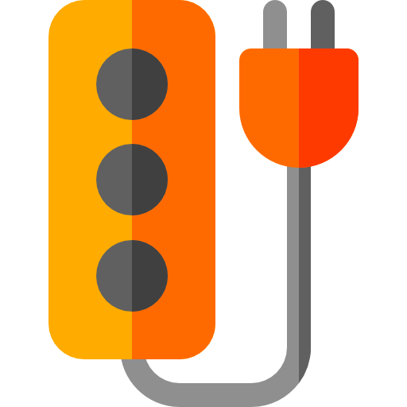

#  Auto-Clicker Target Chrome Extension

## Purpose

This extension provides an auto-clicking functionality for Chromium-based browsers, such as Google Chrome. It allows users to select any clickable element on a webpage and set an interval for automatic clicks.

## What this extension does

It provides the following functionality:

1.  **Element Selection**: Users can easily select any button, link, or other clickable element on a webpage directly from the extension popup.
2.  **Customizable Interval**: Set the auto-click interval in seconds, allowing for precise control over the clicking frequency.
3.  **Start/Stop Control**: Intuitive buttons in the popup to start and stop the auto-clicker at any time.
4.  **Real-time Status**: The popup displays the currently selected element, the set interval, a countdown to the next click, and the overall status of the auto-clicker (Running/Stopped).
5.  **Persistence**: The selected element and interval settings are saved, so the auto-clicker can resume automatically when you revisit or refresh a page.
6.  **Link Navigation**: If the selected element is a link, the extension will simulate navigation to the link's URL.
7.  **Error Handling**: Automatically stops if the selected element is no longer found on the page.

## How to install

1. Clone or download this repository to your local machine.
2. Open your Chrome-based browser and navigate to `chrome://extensions`.
3. Enable "Developer mode" by toggling the switch in the top right corner.
4. Click on "Load unpacked" button that appears after enabling developer mode.
5. Select the directory containing the extension files (the same directory as the `manifest.json` file).
6. The extension should now appear in your browser's toolbar. If it doesn't, check whether it's hidden behind the browser's "puzzle" icon.

## Logo and Icons Attribution

The logo and icons used in this project are attributed as follows:

<a href="https://www.flaticon.com/free-icons/socket" title="socket icons">Socket icons created by Freepik - Flaticon</a>
